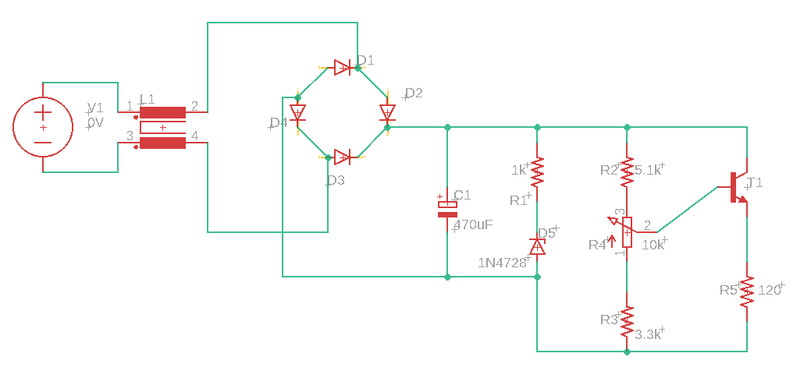
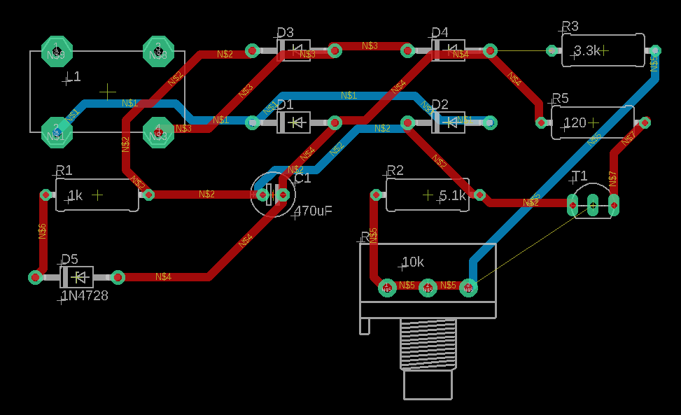

# Projeto 1- Fonte de Tensão 12V

Projeto para a disciplina SSC0180-Eletrônica para Computação no Instituto de Ciências Matemáticas e de Computação (ICMC-USP)

## Especificações

> Fonte de Tensão entre 3V a 12V com capacidade de 100mA

## Componentes

| Componente                                                   | Preço    |
| ------------------------------------------------------------ | -------- |
| 1x [Transformador](https://www.baudaeletronica.com.br/transformador-trafo-12v-12v-500ma-110-220vac.html) | R$ 23,40 |
| 1x [Capacitor 470uF](https://www.baudaeletronica.com.br/capacitor-eletrolitico-470uf-25v.html) | R$ 0,35  |
| 1x [Resistor 1k](https://www.baudaeletronica.com.br/resistor-1k-5-1-4w.html) | R$ 0,08  |
| 1x [Resistor 5k1](https://www.baudaeletronica.com.br/resistor-5k1-5-1-4w.html) | R$ 0,08  |
| 1x [Potenciometro 10k](https://www.baudaeletronica.com.br/potenciometro-linear-de-10k-10000.html) | R$ 1,54  |
| 1x [Resistor 3k3](https://www.baudaeletronica.com.br/resistor-3k3-1-2w.html) | R$ 0,15  |
| 1x [Zener 13V](https://www.baudaeletronica.com.br/diodo-zener-1n4743-13v-1w.html) | R$ 0,21  |
| 4x [Diodo](https://www.baudaeletronica.com.br/diodo-1n4007.html) | R$ 0,48  |
| 1x [Transistor NPN](https://www.baudaeletronica.com.br/transistor-npn-bc337.html) | R$ 0,18  |
| **TOTAL**                                                    | R$ 26,47 |

## Circuito

### Falstad:

- http://tinyurl.com/y7hu6ace

### Esquemático:

### PCB:

